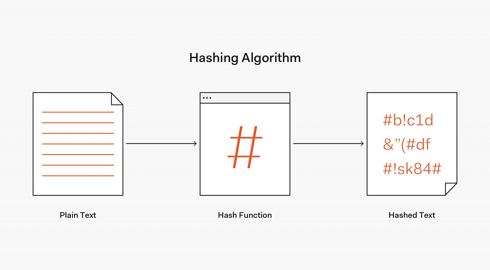

## Bcryptjs is a most important tool for password hashing.

Password hashing means password will be stored in database as a hashed(`$3jwksv37$&hfdh839$h8kow&sjisv3`) instead of plaintext. As a result none can access your real password without you It is a tool used in Node Js with mongoose. 

We use it before saving the data in database. It works as a middleware. Middleware means having access to the request and response cycle and the next function. Which means additional tasks are performed in middleware, and once they are completed, it will call the next function. 

#### What is Next?
In middleware, "next" typically refers to calling the next middleware function in the chain or passing control to the next step in the request-response cycle.

▶ However, code is simple and easy to use Bcryptjs for hashing passwords. 

Just install this tool and import and use it before exporting the Data model.

Suppose we have a data model in Mongoose called `userSchema`, or whatever you named it.

We will target the name of the schema/model (userSchema)

▶ userSchema.pre, "pre means- Before doing anything". Before doing what?...Before saving the password in database we want to hash it.

So the code is-
```
userSchema.pre('save', async function (next){

})
```
▶ save is a type of event. We type `'save'` , because we want to call this middle before calling the save method. 

▶ We declared it as an Async function because it returns promises. Note that you cannot use an arrow function instead of using the classic method, such as function.

#### Why we cannot use Fat arrow function in the bcryptjs for hashing?

We cannot use fat arrow functions instead of using classic methods like `function` in password hashing, because fat arrow functions do not bind their own `this` context. In bcrypt.js, the `this` context is crucial for accessing the properties and methods of the bcrypt object correctly, so using a classic method is necessary to ensure proper functionality.

Next and complete code- 
```
userSchema.pre('save', async function (next){
   if(this.isModified(''password")){
        this.password = await bcrypt.hash(this.password, 12)
}
next()
})
```

▶ this keyword refers to the object it belongs to. Suppose we have e sheet File named MahinFile😁. In the file there many parts, in no 1 part I stored bangla sheets, no 2 part I stored english sheets. Now I asked you what is this? You will normally tell me that it is a file named MahinFile. 

On the other hand, I asked you to target the first part of this file that what is the name of this part? In reply, you will reply me that it is a no1 part of this file named Bangla and i stored bangla sheets here. Now you are understanding?? 😃

In programming, the MahinFile is an object and the sheets of the file part are referring to the value of this keyword. That means if I type 'this' it will directly target to the global object. And if I declared that which part of that object should be targeted using `this.<value>` it will be called the value of that item/key of the object.

▶ So, in this code `this.password` means we have an object and the object has a password (item/key ). Target the value of the password and hash it (`bcrypt.hash`)

▶ `isModified('password')` refers that if the user enter his/her password then we will work on hashing password, otherwise we will do nothing.

▶ "round 12": In bcryptjs, the rounds parameter refers to the number of key expansion rounds used in the bcrypt hashing algorithm. This parameter determines the computational cost of hashing a password.

The higher the number of rounds, the more computationally intensive it is to hash a password, which makes it harder for attackers to perform brute-force or dictionary attacks against hashed passwords.

▶ At last, when the password hashing is done call the next middleware - `next()`

**Note:** We should also include a confirmation password for the password in the same method for hashing.

