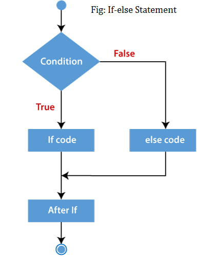

### How do Logical ||(OR) operator and &&(AND) operator work in the place of 'if else' condition statement for dealing with boolean conditions?

1. Condition `||` what to do if conditions are not met
2. Condition `&&` what to do if conditions are met.

**1.** `value1 === value2 || "values are unequal"`
Means, if the condition is true it will return true and if the condition is false it will return "values are unequal"

**2.** `value1 === value2 && "values are equal"`
Means, if the condition is true it will return "values are equal" and if false do nothing.
✓ Many programming languages support the logical `||` (OR) and `&&` (AND) operators as alternatives to if-else conditions for certain scenarios. Some examples include:
✓C,
✓C++,
✓Java,
✓JavaScript and
✓Python (to some extent, using short-circuit evaluation)
These operators are commonly used for conditional expressions and can replace simple if-else constructs in certain situations, especially when dealing with boolean conditions.

